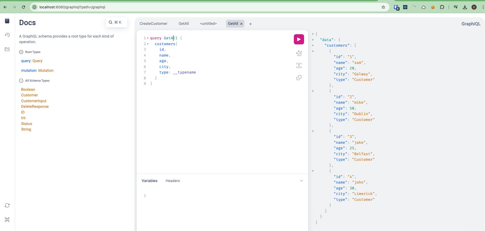
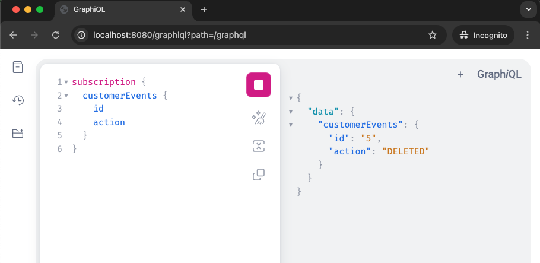

# Overview

Sample SpringBoot app using **WebFlux** and **GraphQL**.
Simple CRUD style app using GraphQL.

#### Setup (using Spring CLI)

Use [Spring Boot CLI](https://docs.spring.io/spring-boot/cli/index.html)
or [Spring Initializr](https://start.spring.io/) with required `--dependencies` below:

```bash
sdk install springboot
spring help init

To list all the capabilities of the service:
spring init --list

# Create the project
cd sample-app-spring-webflux-graphql
spring init \
    --dependencies=actuator,webflux,graphql,lombok,data-r2dbc,h2,validation,devtools \
    --build=maven \
    --group-id=com.github.dkirrane \
    --artifact-id=sample-app-spring-webflux-graphql \
    --name=sample-app-spring-webflux-graphql \
    ./
```

#### GraphQL schemas

- [customer-crud.gql](src/main/resources/graphql/customer-crud.gql) - GraphQL Queries & Mutations for Customer CRUD API.
- [customer-subscription.gql](src/main/resources/graphql/customer-subscription.gql) - GraphQL Subscription for Customer Events API.

#### Source

###### Queries & Mutations

- [CustomerRepository](src/main/java/com/github/dkirrane/sample/repository/CustomerRepository.java) - Customer
  Repository using R2DBC ReactiveCrudRepository.
- [CustomerService](src/main/java/com/github/dkirrane/sample/service/CustomerService.java) - Service for CRUD ops on
  Customer Repository.
- [CustomerController](src/main/java/com/github/dkirrane/sample/controller/CustomerController.java) - GraphQL API
  Controller for Customer CRUD operations.
- [Customer](src/main/java/com/github/dkirrane/sample/entity/Customer.java) - Customer Entity clas for the database.
- [CustomerDto](src/main/java/com/github/dkirrane/sample/dto/CustomerDto.java) - Customer Data Transfer Object (DTO) for
  sending data to and from the GraphQL API.

###### Subscription

- [CustomerEventService](src/main/java/com/github/dkirrane/sample/service/CustomerEventService.java) - Service for
  subscribers of Customer events.
- [CustomerEvent](src/main/java/com/github/dkirrane/sample/dto/CustomerEvent.java) - Customer Data DTO for sending
  Customer events.

## GraphiQL

Run the SpringBoot application and use the baked in GraphiQL to run the GraphQL CRUD queries & mutations:
[http://localhost:8080/graphiql](http://localhost:8080/graphiql)

_See GraphQL Queries, Mutations & Subscriptions below for testing the CRUD application:_



#### Query: Get all Customers

```graphql
query GetAll {
    customers {
        id
        name
        age
        city
        type: __typename
    }
}
```

#### Query: Get Customer By ID

```graphql
query GetCustomerById($id: ID!) {
    customerById(id: $id) {
        id
        name
        age
        city
        type: __typename
    }
}
```

_Sample `id` variable for above Get Customer By ID GraphQL query:_

```json
{
  "id": 2
}
```

#### Mutation: Create Customer

```graphql
mutation CreateCustomer($customer: CustomerInput!) {
    createCustomer(customer: $customer) {
        id
        name
        age
        city
    }
}
```

_Sample `$customer` variable for above Create Customer GraphQL mutation:_

```json
{
  "customer": {
    "name": "dessie",
    "age": 42,
    "city": "Galway"
  }
}
```

#### Mutation: Update Customer

```graphql
mutation UpdateCustomer($id: ID!, $customer: CustomerInput!) {
    updateCustomer(id: $id, customer: $customer) {
        id
        name
        age
        city
    }
}
```

_Sample `$id` and `$customer` variable for above Update Customer GraphQL mutation:_

```json
{
  "id": 5,
  "customer": {
    "name": "dessie",
    "age": 42,
    "city": "Tuam"
  }
}
```

#### Mutation: Delete Customer

```graphql
mutation DeleteCustomer($id: ID!) {
    deleteCustomer(id: $id) {
        id
        status
    }
}
```

_Sample `$id` variable for above Delete Customer GraphQL mutation:_

```json
{
  "id": 5
}
```

#### Subscription: Subscribe to Customer events

_For GraphQL Subscription you can run a second GraphiQL in another Browser window:_



```graphql
subscription {
  customerEvents {
    id
    action
  }
}
```